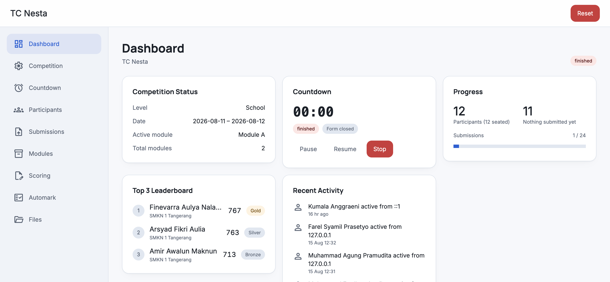

<div align="center">

# LKS Judge Platform

[](https://github.com/fzrilsh/lks-judge/blob/main/LICENSE)
[](https://github.com/fzrilsh/lks-judge/stargazers)
[](https://github.com/fzrilsh/lks-judge/network/members)
[](https://github.com/fzrilsh/lks-judge/issues)
[](https://github.com/fzrilsh/lks-judge/commits)
[](go.mod)

A single-binary judging server for LKS (Lomba Kompetensi Siswa, the Indonesian
vocational skills competition). It runs on a local network and serves the full
event: competition setup, participant registration, a synchronized countdown,
resumable file distribution and submission, jury scoring on the robust
WorldSkills (WSI) scale, and a live public leaderboard.

The server ships as one executable with **zero runtime dependencies**: no PHP,
no Node.js, no external SQLite, no CGO. Copy the binary to the host machine and
run it. It is built for a LAN of roughly 16 simultaneous participants.



</div>


## Highlights

- **Self-contained.** SQLite (`modernc.org/sqlite`) and PDF generation
  (`github.com/go-pdf/fpdf`) are pure Go and compiled in. Nothing to install on
  the host, and the app works fully offline.
- **Live updates.** A WebSocket hub pushes the countdown, score changes, and
  submission activity to every connected screen in real time.
- **Resumable transfers.** Files are uploaded and downloaded in chunks with
  range support, so a dropped connection resumes instead of restarting.
- **Robust scoring.** Raw jury marks are converted to the WSI scale on demand
  and exported to a CIS-style PDF.
- **Operator controls.** A jury dashboard, a nuclear reset with automatic
  backup, leaderboard censoring, and a config-driven automark console.

## Requirements

To run: nothing. The distributed binary is self-contained.

To build from source:

- Go 1.25 or newer
- [`templ`](https://templ.guide): `go install github.com/a-h/templ/cmd/templ@latest`

## Build

```bash
go generate ./...          # compile .templ views and rebuild static/css/app.css
go build ./cmd/server
```

`go generate ./...` must run before `go build` after any change to a `.templ`
file or you will build against stale views.

Windows target for the competition host:

```bash
CGO_ENABLED=0 GOOS=windows GOARCH=amd64 go build -o lks-judge.exe ./cmd/server
```

Ship `lks-judge.exe` and `server.bat` together. Double-clicking `server.bat`
launches the server on `0.0.0.0:80` with a `./data` directory and pauses on exit
so any error message stays readable.

## Run

```bash
./server --data ./data --listen 0.0.0.0:8080
```

| Flag | Default | Meaning |
| ---- | ------- | ------- |
| `--data` | `./data` | Data directory; the SQLite database lives at `{data}/lks.sqlite` |
| `--listen` | `0.0.0.0:8080` | HTTP listen address |
| `--jury-ip` | (none) | Extra jury IP or CIDR granted `/jury/*` access, in memory only. Repeatable or comma-separated. |

All configuration is through flags; there are no environment variables.

### Jury access

Access to `/jury/*` is granted by IP. The persisted allowlist is set in the
competition setup form and stored in the database. `--jury-ip` adds a
runtime-only entry that is never written to the database and survives a reset,
which keeps a fixed operator machine reachable before any competition exists or
after a wipe, for example `--jury-ip 192.168.1.10 --jury-ip 10.0.0.0/24`.
Loopback (`127.0.0.1`, `::1`) is always allowed on top of both lists, so the
machine running the server can always reach the jury pages.

### Data directory

Under `--data` the server keeps, alongside `lks.sqlite`:

| Path | Contents |
| ---- | -------- |
| `backups/` | Database snapshots (periodic and pre-reset) |
| `files/` | Jury-distributed files |
| `submissions/` | Participant work, laid out `{participant_id}/{module_id}/` |
| `uploads_tmp/` | In-flight upload chunks |
| `logs/` | Per-day `YYYY-MM-DD.log`, also teed to the terminal |
| `automark.json` | The saved automark configuration |

## Public pages

These routes need no authentication and are meant for shared screens and
participants:

| Route | Purpose |
| ----- | ------- |
| `GET /countdown` | Full-screen countdown for a projector; sounds an alert at zero |
| `GET /leaderboard` | Public leaderboard; updates live as scores change |
| `GET /login` | Participant sign-in |

Everything under `/jury/*` is restricted to the jury IP allowlist, and each
participant's dashboard and downloads require their session login.

## Operator features

- **Jury dashboard** (`/jury/`): competition status, countdown controls,
  submission progress, the current top three, an activity feed, and
  submission-timing charts.
- **Scoring** (`/jury/scoring`): a raw-score matrix with bulk save and a
  CIS-style PDF export of the scaled results.
- **Leaderboard censoring**: hide ranks, totals, and per-module scores on the
  public leaderboard and shuffle the row order, to reveal standings on the
  jury's schedule rather than live.
- **Automark** (`/jury/automark`): run config-driven HTTP checks against every
  participant's server in parallel, watch results stream in live, and apply the
  scores to a module. A visual builder edits the configuration without hand-editing JSON.
- **Reset**: a guarded nuclear wipe that first snapshots the database to
  `backups/`, then clears every competition, participant, module, score,
  submission, and session. A reset also clears the persisted jury allowlist, so
  recreate the competition from the host machine (loopback) before remote jury
  machines can reach `/jury/*` again.

## Layout

```
cmd/server/         assembler; wires router, store, backup ticker, countdown ticker, WS hub
internal/model/     plain structs, no logic
internal/store/     SQLite pools, migrations, caches
internal/web/       handlers, middleware, templ views, embedded static assets
internal/realtime/  countdown timing and the WebSocket hub
internal/upload/    filesystem chunk tracker, resumable upload handlers, session cleanup
internal/scoring/   robust WSI scale, leaderboard cache, CIS PDF export
internal/automark/  config-driven HTTP marking engine
internal/excel/     participant import/export
internal/backup/    periodic VACUUM INTO
docs/               changelog and the specification (source of truth)
```

## Development

```bash
go generate ./...   # after any .templ or Tailwind change
go build ./cmd/server
go test ./...
go test ./... -race
```

Styling is Tailwind v4. The source is `internal/web/tailwind.css`; `go generate`
runs the standalone `tools/tailwindcss` CLI to regenerate the committed, embedded
`internal/web/static/css/app.css` (see [`tools/README.md`](tools/README.md)).
Because `app.css` is committed and embedded, `go build` alone works without the
CLI; you only need it to regenerate `app.css` after changing the styles or the
class strings in `.templ` / `static/js/*.js` files.

Contributions use conventional commits (`feat(scope): ...`, `fix`, `docs`,
`chore`, `refactor`) and the branch flow `feat/*` -> `develop` -> `staging` ->
`main`, with no direct commits to `main`. Run `lefthook install` before your
first commit; pre-commit runs gofmt, `go vet`, and golangci-lint, and pre-push
runs `go build ./...` and `go test ./...`.

## License

Released under the [MIT License](LICENSE).

Built by [WebTech Indonesia](https://github.com/webtechindonesia).